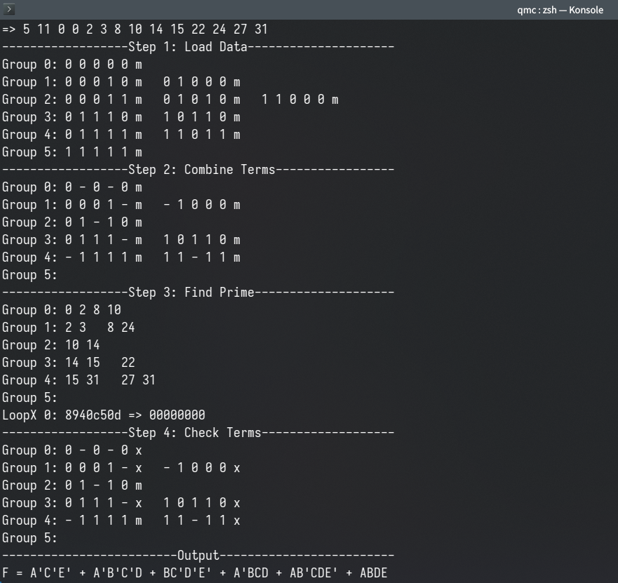

Q-M
===



## Usage

```
N M D M{...} D{...}

N: Number of variables
M: Number of minterms
D: Number of don't-care terms
M{...}: Minterms
D{...}: Don't-care terms
```

## Run

```
gcc qmc.cpp && ./a.out
```
